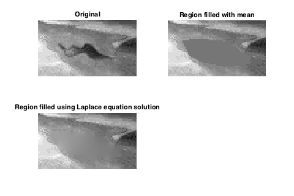
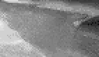

<!-- vim: set filetype=none:
  Turn off markdown-type because LaTeX-notation
  doesn't work with markdown-mode.
  -->

# region-fill-dirichlet

The new design is now the recommended default.

The test-code for the old design has the neat
feature of propagating noise from the boundary
into the interior, but I have not reproduced
that in the test-code for the new design.

## Current Design Under Namespace `dirichlet`

Current code requires at least

- Eigen-3.4
- Catch2-3.0 (for unit-tests)

Design under `dirichlet` internally uses Eigen
throughly (almost no for-loops), minimizes
copying, and does not use `std::map`, as old
design did for building coefficients for
sparse matrix.

The basic idea is to employ an interface
enabling speed and flexibility.  The constructor
for
[`dirichlet::Fill`](include/dirichlet/Fill.hpp)
and the constructed function-object will do very
little copying.  The function that solves the
Dirichlet-problem will copy the solution back
into the original image only if that image be
passed to constructor by way of non-const
pointer.  Anyway, the solution, only for the
specified pixels, is returned by the
function-object.

Speed with `-O3` is much faster than that of
old design with `-O3`.

Conjugate-gradient solution is now available as
final, optional argument to constructor.  It is
faster than Cholesky to construct instance of
`Fill` on my test-image, but it is slower than
Cholesky to solve.  Overall, CG is slower than
Cholesky on my test-image.  It is turned off by
default for the moment.  Nevertheless,
unit-tests all use conjugate-gradient and look
OK.

Here are the original image, the mask, the
filled image produced by implementation of new
design, and a histogram-equalized image zoomed
in on the central, filled circle:

## Idea for Yet More Speed in Future Version

Suppose that "deep" and "shallow" are taken to
refer to proximity to the boundary of the region
to be filled.  The deepest pixels are the ones
farthest from the boundary of the region to be
filled, and the shallowest are the ones nearest
the boundary.

In a large region filled according to Laplace's
equation, the pixel-values are most smoothly
distributed across deepest portions of the
region.

Because of the underlying geometry of the
pixel-grid, an approach based on the bilinear
interpolation over a square group of pixels
seems natural.  Although the bilinear
interpolant is linear along each
coordinate-axis, it is quadratic along any other
direction.  Anyway, the bilinear interpolant
satisfies Laplace's equation.  So, if the border
of the square participate in a global solution
to Laplace's equation, then the interpolant
provides a local solution that is at least
continuous with the global one.

What I propose is a hierarchical approach, in
which the deepest portions of the region to be
filled have the largest interpolated squares,
shallower portions have smaller interpolated
squares, and, in the shallowest portions, every
individual pixel participates in a
finite-element solution to Laplace's equation.

### Prepare Image and Mask

Consider an image $I$ and a mask $M$, each of
size ${W}\times{H}.$  Let the mask have value of
1 at each pixel to be filled and 0 at each pixel
not to be filled.

Extend $I$ to a larger image $I_0$ by
replicating border-values from $I$ until, for
the smallest integer $w,$ the width of $I_0$ is

$$ W_0 = 2^w \geq W + 2^{b + 2} $$

and, for the smallest integer $h,$ the height is

$$ H_0 = 2^h \geq H + 2^{b + 2}, $$

where $b$ is an integer parameter indicating the
greatest level of binning to be considered.

For each $i\in(1,2,\dots,b),$ an image $I_i$ and
a mask $M_i$, each consisting of superpixels, is
constructed as described below.  The coarsest,
binned image that will be considered consists of
superpixels, each of which corresponds to
${2^b}\times{2^b}$ original pixels.

After $I$ has been extended, $I$ should be
roughly centered within $I_0,$ whose border has
been replicated from the outer-most pixels of
$I$ to equal thickness along every side.

Similarly, extend $M$ to a larger mask $M_0$ but
by replicating zeros outside $M$.

### Find Squares Over Which To Interpolate

Construct every successive, binned image of
$I_0$ and $M_0.$  First,

- $I_1$ and $M_1$, each of which has
  $W_1=W_0/2$, has $H_1=H_0/2$, and is binned
  into superpixels, each of ${2}\times{2}$
  unbinned pixels; then

- $I_2$ and $M_2$, each with superpixels of
  ${4}\times{4}$ unbinned pixels;

- $I_3$ and $M_3$, each with ${8}\times{8}$
  superpixels; etc.

In the case of $M_i,$ for any $i,$ each
superpixel contains the *sum* of the four
corresponding pixel-values at the next higher
stage of resolution.  In the case of $I_i,$ each
superpixel contains the *mean* of a subset of
the unbinned pixels lying within the superpixel.
The mean is calculated from those unbinned
pixels, each of which has value 0 in the
corresponding mask-pixel.

Construct $I_1,I_2,\ldots,I_b,$ and
$M_1,M_2,\ldots,M_b,$ where $b$ is the largest
value of the binning parameter as described
above.  At each stage $i\in(1,\ldots,b)$ of
binning, for the mask-image $M_i,$ store the
location of each ${2}\times{2}$ block of
superpixels, every one of whose four superpixels
has value $2^{2i}$.

After construction of the binned images, next
consider them, beginning with $b,$ in reverse
order, for each $i\in(b,b-1,\dots,1).$

For each $M_i$ in $M_b,M_{b-1},\ldots,M_1,$ find
each ${2}\times{2}$ constained, as described
above, completely within the region of pixels to
be filled.  When at least one such block exists,
solve the Dirichlet-problem at this binning
level for the value of every pixel that, in the
mask-image, has non-zero value.  The weights are
generalized from those used in the standard
solution.  A superpixel that contains both
unbinned pixels in the region to be filled and
pixels on the boundary will be weighted relative
to its neighbors so that what is solved for in
the linear problem is only that portion of its
value weighted by the fraction $f$ of
mask-pixels with value 1. The remaining fraction
$1-f$ is used to weight the mean value of the
boundary-pixels within it, as if they were
another neighbor.  Use a superpixel in $I_i$ as
pure boundary-value whenever the corresponding
superpixel in $M_i$ has zero value.

After the solution has been found at the current
level of binning, suppose that a superpixel's
value applies at the center of the superpixel,
and, for each ${2}\times{2}$ block described
above, linearly interpolate values across the
unbinned pixels in the square region, each of
whose corners is the center of one of the
superpixels in the ${2}\times{2}.$

Redo the binning for those interpolated pixels
from the bottom up in $I_1,\ldots,I_{i-1},$ and
reset to zero every pixel corresponding to an
interpolated pixel in every higher-resolution
mask $M_{i-1},\ldots,M_1.$

Then proceed to $i-1$ and repeat until $i=1.$

Finally, solve the Dirichlet problem for the
remaining unbinned pixels.

### Prepare Linear Model

When the size of the region to be filled is
larger than, say, $128 \times 128$ pixels, the
elimination of the interior pixels from each
interpolable superpixel drastically reduces the
size of the linear problem.  The time to factor
the matrix and to render the solution should be
greatly reduced for any sufficiently large
region of pixels to be filled.

## Old Design Under Namespace `regfill`

Application of the Dirichlet problem to the
filling of a bounded region of an image.

Although I worked out the solution while waiting
for my daughter to finish softball-practice,
when I later searched for this technique, I
found that (not surprising!) this had already
been done.  See [Region Filling and Laplace's
Equation](https://blogs.mathworks.com/steve/2015/06/17/region-filling-and-laplaces-equation/).

Here are some images from that blog post:

My contribution is, first of all, to provide a
solution that depends not at all on proprietary
software like Matlab.  Rather, I use C++ and
[Eigen](http://eigen.tuxfamily.org/index.php?title=Main_Page).
Second, I improve upon the approach of Eddins by
using Laplace's equation in order to propagate
high-spatial-frequency noise from the boundary
into the region.

Here are some images from implementation of old
design:

## Copyright

Copyright 2018-2022 Thomas E. Vaughan.  See
terms of redistribution in [LICENSE](LICENSE).

<!--
Narrow textwidth allows editing of file in
cell-phone's browser.

vim: set tw=48:
-->
