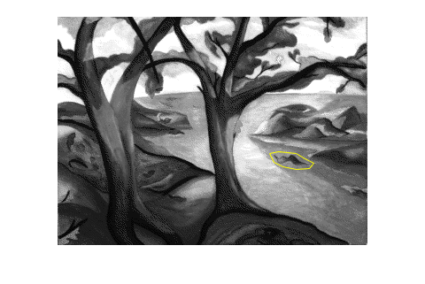
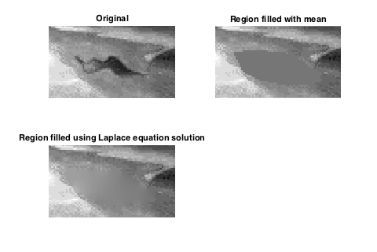
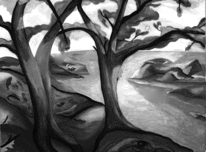

# region-fill-dirichlet

Application of the Dirichlet problem to the filling of a bounded region of an
image.

In this project, I produce a document that explains the theory of applying
Laplace's equation to the filling in of a closed region in a monochromatic
image.  Also, I produce a C++ program to implement the approach described in
the document.

Although I worked out the solution while waiting for my daughter to finish
softball-practice, when I later searched for this technique, I found that (not
surprising!) this had already been done.  See [Region Filling and Laplace's
Equation](https://blogs.mathworks.com/steve/2015/06/17/region-filling-and-laplaces-equation/).

Here are some images from that blog post:

My contribution is, first of all, to provide a solution that depends not at all
on proprietary software like Matlab.  Rather, I use C++ and
[Eigen](http://eigen.tuxfamily.org/index.php?title=Main_Page).  Second, I
improve upon the approach of Eddins by using Laplace's equation in order to
propagate high-spatial-frequency noise from the boundary into the region.

Here are some images from my work:

