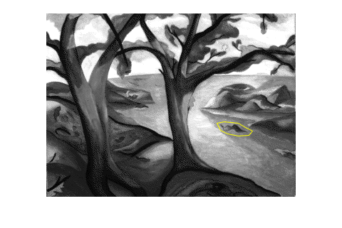
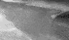

# region-fill-dirichlet

Application of the Dirichlet problem to the
filling of a bounded region of an image.

In this project, I produce a document that
explains the theory of applying Laplace's
equation to the filling in of a closed region in
a monochromatic image.  Also, I produce a C++
program to implement the approach described in
the document.

Although I worked out the solution while waiting
for my daughter to finish softball-practice,
when I later searched for this technique, I
found that (not surprising!) this had already
been done.  See [Region Filling and Laplace's
Equation](https://blogs.mathworks.com/steve/2015/06/17/region-filling-and-laplaces-equation/).

Here are some images from that blog post:

My contribution is, first of all, to provide a
solution that depends not at all on proprietary
software like Matlab.  Rather, I use C++ and
[Eigen](http://eigen.tuxfamily.org/index.php?title=Main_Page).
Second, I improve upon the approach of Eddins by
using Laplace's equation in order to propagate
high-spatial-frequency noise from the boundary
into the region.

Here are some images from my work:

## Redesign Under Namespace `dirichlet`

Redesigned code requires at least
- Eigen-3.4
- Catch2-3.0 (for unit-tests)

After initial design and implementation as code
under namespace `regfill`, improved design and
implementation is under namespace `dirichlet`.

Design under `dirichlet` internally uses Eigen
throughly (almost no for-loops now), minimizes
copying, and does not use `std::map`.

The basic idea is to employ an interface
enabling speed and flexibility.  The Constructor
for
[`dirichlet::Fill`](include/dirichlet/Fill.hpp)
and the constructed function-object will do very
little copying. The function that solves the
Dirichlet-problem will copy the solution back
into the original image only if that image be
passed to constructor by way of non-const
pointer.  Anyway, the solution, only for the
specified pixels, is returned by the
function-object.

Copyright 2018-2022 Thomas E. Vaughan.  See
terms of redistribution in [LICENSE](LICENSE).

<!--
Narrow textwidth allows editing of file in
cell-phone's browser.

vim: set tw=48:
-->
